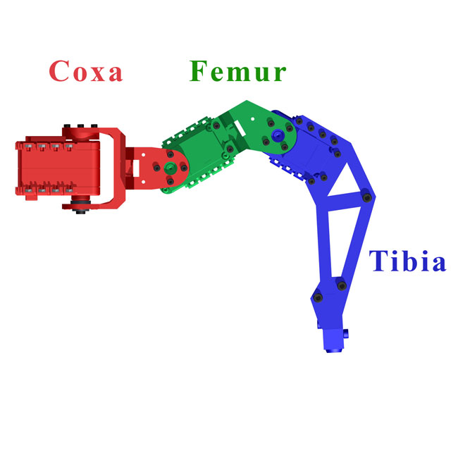

# adaptive-hexapod-control
adaptive control and simulation for hexapod mk-III

## Model
Stl files was extracted from the complete hexapod model using fusion 360 and broght together using mojuco's xml.\
The body was seperated from the legs and each leg was separated to 3 pieces according the joints.\
 
### Hexapod mk-III model

### Body stl

### Coxa stl

### Femur stl

### Tibia stl

