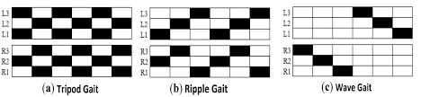

# adaptive-hexapod-control
adaptive control and simulation for hexapod mk-III

## Model
Stl files was extracted from the complete hexapod model using fusion 360 and brought together using mojuco's xml.\
The body was separated from the legs and each leg was separated to 3 pieces according the joints.\

### Hexapod mk-III model

### Gaits
currently, 3 basic walking gait was implements:

## Loop
The simulation is based on the following loop as seen in main.py: 
1. load mujoco model from xml.
2. get state
3. generate action (joints target angles)
4. step hexapod into this direction and calculate joint's speed.
5. goto 2.

## Structure
directory structure is as follows: 
* <b>gait</b>: motion script and action generator.
* <b>kinematics</b>: inverse and forward kinematics for leg swing use (input: joint angles, target position. output: joints angles to get to target).
* <b>model</b>: model of hexapod: environment, legs and joints description.
* <b>mujoco models</b>: xml and stl files to  load physical model.
* <b>main</b>: main file, starts simulation.
