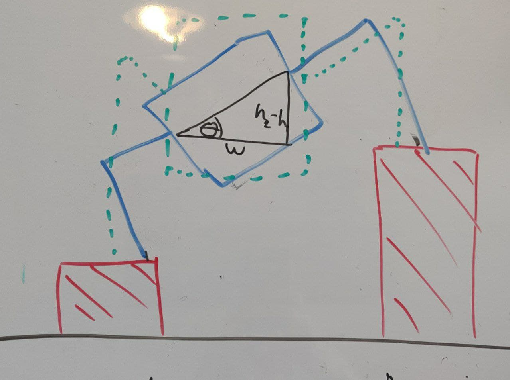
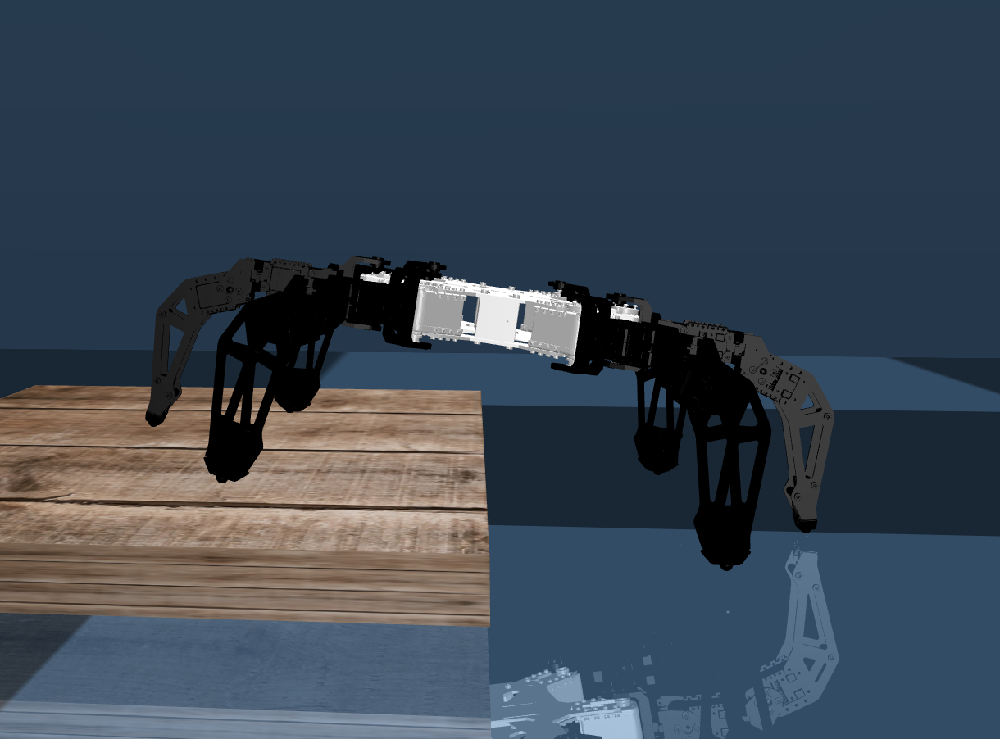
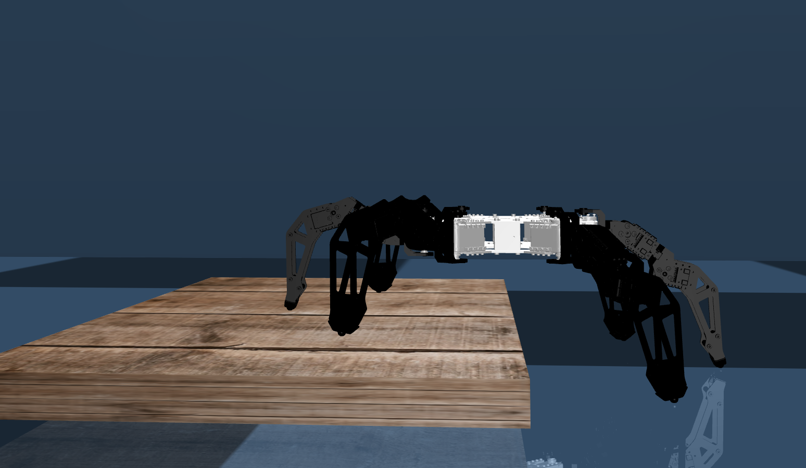

# Body Leveling key points

Given the hexapod in a certain position.
We monitor the height (and constant width) in each connection to the body i.e. coxa.

Let's first consider a simple scenario in 2D:

The axes in which we consider the problem are y and z (x is equal) so:  and  but this should be constant. Thus, the angle of rotation is .

The algorithm for body leveling given  is:
1. Get  (by sensing with SNN or direct simulation output)
2. calculate 
3. get target orientation  (in out case is hard-coded 0 but it can be an output of SNN as well)
4. for each leg i:
   - get current angles of joints  
   - using forward kinematics calculate the radius in y,z plane using 
   - if the leg is in the left side (yz plane spesific)  and  
   - calculate cartesian change of the leg given a rotation around the body center with the radius and  (convert polar to cartesian and return the difference)
   - extend the 2d to 3d by setting , the result is difference 3d vector 
   - using inverse kinematics, calculate the angles which will make the leg go from it's current position to 
   - set new angles from inverse kinematics

## Results

